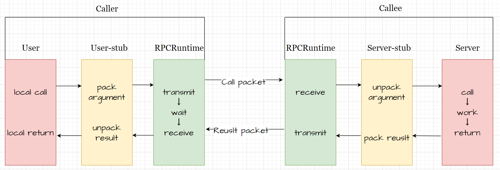

# 分布式集群网络通信框架 - rpc 通信原理
 
## 技术运用
* 集群和分布式概念以及原理
* RPC远程过程调用原理以及实现
* protobuf 数据序列化和反序列化协议
* zookeeper 分布式一致性协调服务应用以及编程
* muduo 网络库编程
* conf 配置文件读取
* 异步日志
* CMake 构建项目集成编译环境

## 集群和分布式

**集群**：每一台服务器独立运行一个工程的所有模块。

**分布式**：一个工程拆分了很多模块，每一个模块独立部署运行在一个服务器主机上，所有服务器协同工
作共同提供服务，每一台服务器称作分布式的一个节点，根据节点的并发要求，对一个节点可以再做节点模块集群部署。

## RPC通信原理
RPC（Remote Procedure Call Protocol）远程过程调用协议。

黄色部分：设计rpc方法参数的打包和解析，也就是数据的序列化和反序列化，使用protobuf

绿色部分：网络部分，包括寻找rpc服务主机，发起rpc调用请求和响应rpc调用结果，使用muduo网络库和zookeeper服务配置中心
